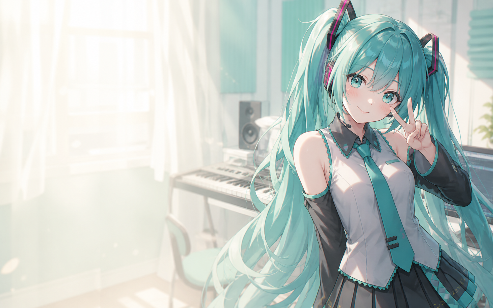
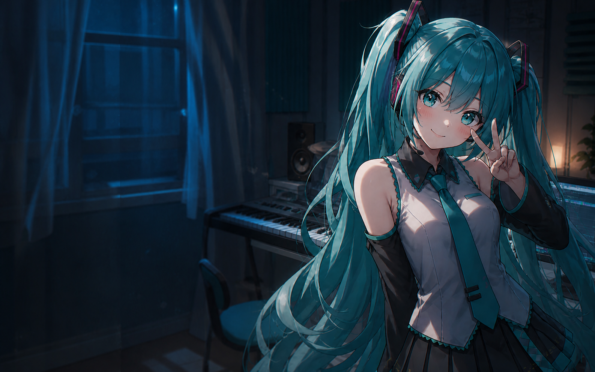

<div align="center">

# Paseo Miku Theme

A polished Hatsune Miku-inspired light and dark theme pack for
[Paseo](https://github.com/getpaseo/paseo), with lossless illustrated wallpapers
and carefully scoped frosted-glass surfaces.

**English** · [简体中文](./README.zh-CN.md)

</div>

> [!NOTE]
> This is an unofficial fan-made theme and is not affiliated with or endorsed by
> Crypton Future Media, Inc. Hatsune Miku and related marks belong to their
> respective owners.

## Preview

| Miku Future Light | Miku Future Dark |
| --- | --- |
|  |  |

## Features

- Two complete Paseo color themes: **Miku Future Light** and **Miku Future Dark**.
- Original lossless PNG artwork is embedded in the plugin. At runtime it is exposed
  through short Blob URLs, preserving every source byte without hitting Chromium's
  data-URL length limit.
- The conversation history and composer share one continuous wallpaper.
- Your message bubbles and the composer card use a restrained translucent glass
  treatment with an `18px` backdrop blur; AI responses remain visually lightweight.
- Markdown preview and source-code views inherit the wallpaper with a uniform
  readability scrim.
- Git diffs receive a subtle, non-interactive wallpaper texture that keeps code text
  clear.
- No left-to-right gradient mask: the same scrim is applied across the full image.
- Menus, settings, terminals, sidebars, and unrelated work surfaces retain Paseo's
  original opaque materials.
- Wallpaper enhancement automatically disables below `721px` and whenever a non-Miku
  theme is selected.

## Readability

The base theme colors meet WCAG AA contrast requirements for normal text:

| Theme | Body / background | Muted text / background | Button text / accent |
| --- | ---: | ---: | ---: |
| Light | `12.31:1` | `4.89:1` | `4.69:1` |
| Dark | `16.37:1` | `8.35:1` | `8.45:1` |

Wallpaper surfaces add a uniform light or dark scrim on top of those base colors.

## Platform support

Paseo's official `addTheme` API accepts colors but not background images. This plugin
therefore treats the artwork as a progressive enhancement:

| Platform | Theme colors | Illustrated wallpaper |
| --- | :---: | :---: |
| Paseo Desktop / Electron | Yes | Yes |
| Paseo Web | Yes | Yes |
| iOS / Android | Yes | No |

If Paseo's DOM changes in a future release, the official color themes continue to
work even when the wallpaper enhancement cannot be applied.

## Installation

Paseo `v0.5.0` or newer is required. In Paseo, open **Settings → Plugins** and enable
**Enable plugins** first.

Then clone this repository and install its plugin directory:

```bash
git clone https://github.com/ZhonghuaYi/paseo-miku-theme.git
cd paseo-miku-theme
paseo plugin install "$(pwd)/miku-future"
paseo plugin ls
```

Open **Settings → Appearance → Theme**, then select **Miku Future Light** or
**Miku Future Dark**.

## Updating

```bash
git pull
paseo plugin reload miku-future
```

For a remote daemon, append `--host <url>` to the Paseo command.

## Development

The distributable plugin lives in [`miku-future/`](./miku-future):

- `index.ts` defines both official Paseo color themes;
- `background.client.ts` applies and cleans up the Web/Electron wallpaper enhancement;
- `assets/` contains only the two lossless PNG files used at runtime;
- `background-data.client.ts` is generated from those PNG files.

After replacing either PNG, regenerate the embedded client data and reload the plugin:

```bash
node miku-future/scripts/embed-backgrounds.mjs
paseo plugin reload miku-future
```

## Uninstalling

```bash
paseo plugin remove miku-future
```

## README languages

GitHub does not currently switch repository READMEs according to a visitor's interface
language. Use the language links at the top of this page to switch between the complete
English and Simplified Chinese versions.
